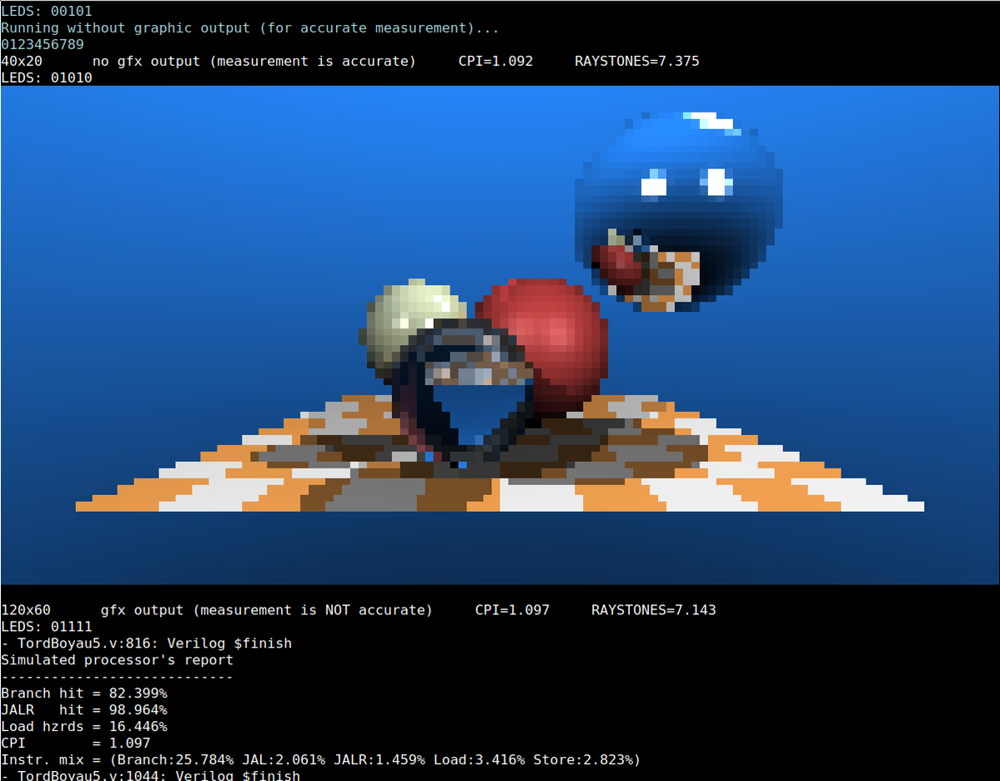
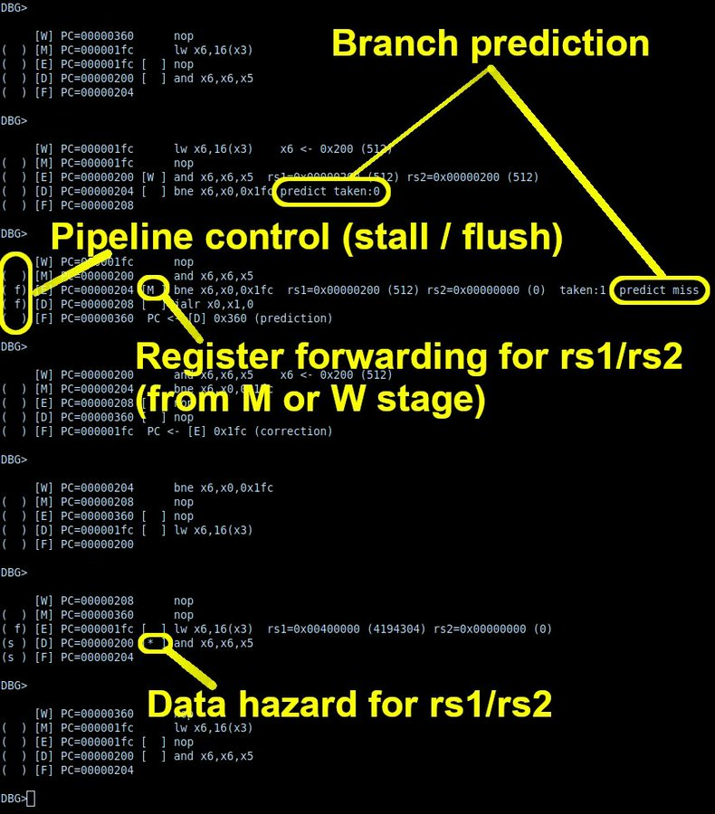

# TordBoyau
A pipelined RISC-V processor

# Instructions
Included Vivado project is configured for an ARTY A35T

- Load project in Vivado, synthesize, create bitstream, send to device
- Included firmware computes a raytracing image and displays it on the TTY using ANSI codes
- Connect to terminal using 1000000 bauds (see `terminal.sh`, adapt to your setup)

Instructions for other boards / Yosys-NextPNR are coming

# Configuration
Several parameters can be configured in `soc.v`:

| Name               | Description                                                                 |
|--------------------|-----------------------------------------------------------------------------|
|`CPU_FREQ`          | Depending on the options, timings will validate around 100-120 MHz          |
|`CONFIG_PC_PREDICT` | Enables `D`-`F` path, used by branch prediction and return address stack    |
|`CONFIG_RAS`        | Enables return address stack                                                |
|`CONFIG_GSHARE`     | GSHARE branch predictor (uses BTFNT if not set)                             |
|`CONFIG_RV32M`      | RV32M instruction set (`MUL`,`DIV`,`REM`).                                  |
|`CONFIG_DEBUG`      | Enables built-in debugger/disassembler (used in simulation)                 |
|`CONFIG_INITIALIZE` | Initializes register file and BHT (required by Icarus and some synth tools) |

# Firmware

Firmware takes the form of two files, `PROGROM.hex` that contains
code, and `DATARAM.hex` that contains variables initialization. The
included firmware computes an image in raytracing and sends it to the
TTY (1000000 bauds). It also measures the average CPI, and a
'raystones' performance score (pixels/s/MHz).

Other firmwares can be compiled, see [learn-fpga, pipeline
tutorial](https://github.com/BrunoLevy/learn-fpga/blob/master/FemtoRV/TUTORIALS/FROM_BLINKER_TO_RISCV/PIPELINE.md)
for more details (`PROGROM.hex` and `DATARAM.hex` are portable between
both projects, just make sure you target the same instruction set
(RV32I or RV32IM).

# Debugger / disassembler

# Documentation on the design 
- [Course - episode I](https://github.com/BrunoLevy/learn-fpga/blob/master/FemtoRV/TUTORIALS/FROM_BLINKER_TO_RISCV/README.md)
- [Course - episode II](https://github.com/BrunoLevy/learn-fpga/blob/master/FemtoRV/TUTORIALS/FROM_BLINKER_TO_RISCV/PIPELINE.md)

